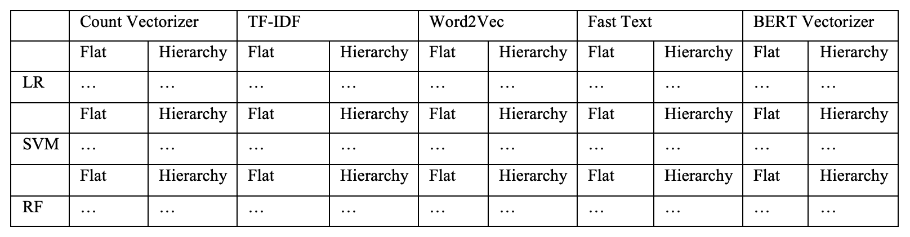

# Classifying Conflict Event Data: A Comparison of Flat and Hierarchical Classification Techniques

This repository is part of the master thesis 'Classifying Conflict Event Data: A Comparison of Flat and Hierarchical Classification Techniques' by Friederike Bauer written as part of the master 'Social and Economic Data Science' at the university of Konstanz.

It is used to perform the analysis of comparing flat and hierarchical text classification.

The combination of feature extractor + classifier + classification mode (flat or hierarchical) creates these model combinations:

The file structure is as follows:

    acled-classification
    ├── data
    │ ├── raw                       # includes all the downloads from the ACLED data export tool
    │ └── processed                 # all training and test data that was processed is saved here
    │
    ├── paths
    │ └── .env.eda                  # file declaring all paths
    │
    ├── src
    │ ├── eda
    │ │ ├── class_distribution_visualization.py
    │ │ └── crossvalidation_analysis.py
    │ │
    │ ├── evaluation_graphs
    │ │ ├── level2.py
    │ │ ├── predictions_shares.py
    │ │ └── runtime.py
    │ │
    │ ├── feature extractors
    │ │ ├── BERT_vectorizer.py
    │ │ ├── CountVectorizer.py
    │ │ ├── FastText.py
    │ │ ├── TFIDF.py
    │ │ └── Word2Vec.py
    │ │
    │ ├── logs                      # logs are created to oversee the scripts
    │ ├── models
    │ │ ├── LR.py
    │ │ ├── RF.py
    │ │ └── SVM.py
    │ │
    │ ├── predictions
    │ │ ├── model_combinations.png
    │ │ ├── lr_flat_level2.py
    │ │ ├── ...
    │ │ └── svm_hierarchical.py
    │ │
    │ ├── preprocess
    │ │ ├── dataset_creation.py
    │ │ └── preprocessing.py
    │ │
    │ ├── results
    │ │ ├── cross_validation
    │ │ └── prediction_results
    │ │
    │ ├── utils
    │ │ ├── conversion_functions.py
    │ │ ├── cross_validation.py
    │ │ └── evaluation_functions.py
    │ └── settings.py
    │
    ├── .gitignore
    ├──poetry.lock
    ├──pyproject.toml
    └── README.md

# Steps in order:

## 1) Dataset creation

The raw data can be download via the ACLED website. All data years 1997 - 2022 are used and all available countries and event types.

-> file src.preprocess.dataset_creation.py

## 2) Dataset preprocessing

Raw data files are preprocessed to only include the notes section and info about event type and sub-event type. Other methods for cleaning the notes section and enriching the data are applied.

-> file src.preprocess.preprocessing.py

## 3) Predictions and Evaluation

The scripts in src.predictions are written for the predictions that are analysed in the thesis. An overview of them can be found in the following table:

| Classifier             | Flat                                     | Hierarchical                                            |
| ---------------------- | ---------------------------------------- | ------------------------------------------------------- |
| Logistic Regression    | lr_flat_level1.py lr_flat_level2.py   | lr_hierarchical.py lr_hierarchical_three_levels.py   |
| Support Vector Machine | svm_flat_level1.py svm_flat_level2.py | svm_hierarchical.py svm_hierarchical_three_levels.py |
| Random Forest          | rf_flat_level1.py rf_flat_level2.py   | rf_hierarchical.py rf_hierarchical_three_levels.py   |

Each script uses all combinations of the classifier and all feature extraction methods. The option for cross-validation is commented out due to long runtime but can be un-commented for running the cross-validation analysis. The evaluation of the feature extraction and classifier combinations happens through these scripts. Files for the results will be generated in src.results (either in cross_validation or prediction_results) and sorted into folders by classifier.
